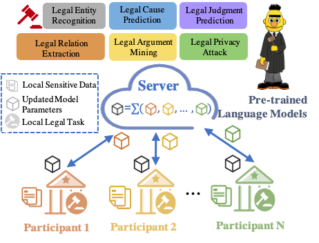
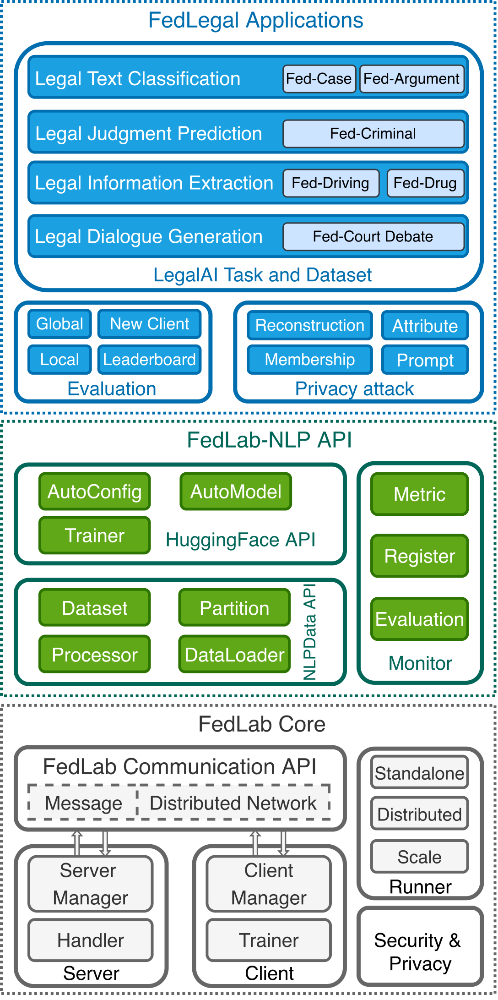

<h1 align="center">  
    <p> FedLegal: The First Real-World Federated Learning Benchmark for Legal NLP </p>  
</h1>  
 
 <p align="center"> 
	 
	 
	 
 </p>
 
<h3 align="center">  
    <p> 致力于联邦智能司法发展 </p>  
</h3>  

> Paper: FedLegal: The First Real-World Federated Learning Benchmark for Legal NLP  
> Accepted by ACL 2023

1️⃣ 本项目来自 [SMILELab-FL](https://github.com/SMILELab-FL/FedLab-NLP) , 我们主要致力于联邦自然语言处理在智能司法上的发展；  
2️⃣ `FedLegal`是一款轻量级、可自由定制联邦学习过程并面向于Legal AI的代码框架；  
3️⃣ `FedLegal`主要实现基于 [FedLab](https://github.com/SMILELab-FL/FedLab) 和 [HuggingFace](https://github.com/huggingface/transformers)，能完成自然语言预训练大模型在联邦学习司法场景下工作；  
4️⃣ 任何使用问题可以联系 :e-mail: iezhuo17@gmail.com, starry.hxj@gmail.com

<div style="text-align:center">
    
</div>

## Abstract
The inevitable private information in legal data necessitates legal artificial intelligence to study privacy-preserving and decentralized learning methods. Federated learning (FL) has merged as a promising technique for multiple participants to collaboratively train a shared model while efficiently protecting the sensitive data of participants. However, to the best of our knowledge, there is no work on applying FL to legal NLP. To fill this gap, this paper presents the first real-world FL benchmark for legal NLP, coined FedLegal, which comprises five legal NLP tasks and one privacy task based on the data from Chinese courts. Based on the extensive experiments on these datasets, our results show that FL faces new challenges in terms of real-world non-IID data. The benchmark also encourages researchers to investigate privacy protection using real-world data in the FL setting, as well as deploying models in resourceconstrained scenarios. The code and datasets of FedLegal are available here.

## Framework
FedLegal框架基于一个轻量级的联邦学习开源框架FedLab，提供了各种法律任务的训练pipeline，并集成HuggingFace以便研究者使用丰富的预训练语言模型。
<div style="text-align:center">
    
</div>

## Installation

### 目录组织  
我们建议按照如下的文件结构来使用`FedLegal`:    

    dataset:  存放数据集，注意该数据集需要已经经过 iid/niid 划分的联邦数据集;
    pretrained:  在nlp文件夹里存储从huggingface中下载的预训练模型，如`bert-base-uncased`;
    code:  在该文件夹下面使用`FedLegal`;
    output: 存储模型输出的记录等。

目录组织如下：
```grapha  
├── workspace  
│   └── datasets  
|   |   ├── legal  
|   |   ├── fedglue  
|   |   └── fedner  
│   ├── pretrained  
│   │   ├── nlp  
│   │   └── cv  
│   ├── output  
│   └── code  
│       └── FedLegal
```  
  
运行路径生成：  
```bash  
mkdir workspace  
cd workspace  
mkdir datasets  
mkdir code  
mkdir pretrained  
cd pretrained  
mkdir nlp  
cd ..  
cd code  
```  

### 数据下载
集中式数据、天然联邦划分数据、狄利克雷采样联邦划分数据、以及用户本地数据按比例0.1,0.5抽取的数据已经打包存储在[该文件中](https://drive.google.com/file/d/1i1wmsJIL-67-Qq_wrr0M00oMCcJNaxbO/view?usp=sharing)。
 
### 环境安装  
建议运行环境的`python`版本为`3.7+`，我们建议使用`pytorch`版本为`1.10+` 
```bash  
git clone git@git.openi.org.cn:Trustworthy-DL/FedLab-NLP.git  
cd FedLegal  
conda create -n fedlegal python=3.7
conda activate fedlegal
pip install torch==1.13.1+cu116 --extra-index-url https://download.pytorch.org/whl/cu116
pip install -r resquirements.txt  
```

## Usage
支持 `fedavg` 联邦学习算法
```bash
bash fed_run.sh {your_file_path}/workspace {task_name} fedavg 10001 {server_gpu_id} {client1_gpu_id} {client2_gpu_id}
```

支持 `centralized` 集中训练学习算法
```bash
bash cen_run.sh {your_file_path}/workspace {task_name} centralized 10001 {server_gpu_id}
```

## Reproduce
`scripts`提供了有关论文实验运行的脚本。


## License
[Apache License 2.0](https://git.openi.org.cn/Trustworthy-DL/fednlp-dev/src/branch/master/LICENSE)

